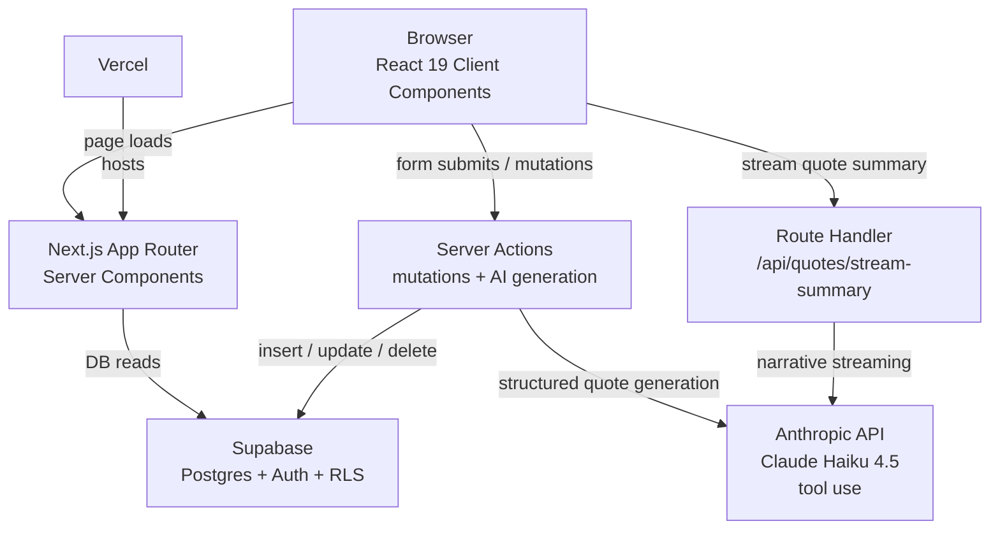

# QuoteMate NZ

QuoteMate NZ is an AI + full-stack portfolio project for New Zealand trade businesses.
The app helps an authenticated user capture customer inquiries, generate structured quote drafts with AI, edit and refine them inline, and export them as PDFs — with a guest demo available at the live link below.

Live demo: [https://quotemate-nz.vercel.app](https://quotemate-nz.vercel.app) — click **Try demo** to explore with pre-seeded NZ trade data, no sign-up required.

## Tech Stack

- Next.js 16.2.4
- React 19
- TypeScript (strict)
- Tailwind CSS 4
- Supabase Auth + Postgres + Row Level Security (RLS)
- Anthropic SDK using `claude-haiku-4-5-20251001`
- Vercel
- GitHub Actions CI

## Core Features

- **Guest demo**: One-click demo login with 6 pre-seeded NZ trade inquiries and 4 quotes; read-only amber banner prevents accidental data changes.
- **Auth**: Sign up, login, and protected app routes.
- **Inquiry workflow**: Full CRUD — create, read, update, and delete; deleting an inquiry cascade-deletes its quotes.
- **AI quote generation**: Server-side quote drafting via Anthropic tool use; Claude returns structured line items validated against a typed schema before DB insert.
- **Structured line items**: Each line item has a description, category (materials / labor / subcontractor / other), and GST-exclusive amount.
- **GST calculation**: Subtotal, GST (15%), and total are computed in code — never trusted from the AI.
- **Inline quote editing**: Expand any historical quote card and click Edit to modify descriptions, categories, and amounts per row; add rows (up to 6) or remove rows (min 2); live totals update as you type; saves via a Server Action with server-side re-validation.
- **Quote history**: Inquiry detail page lists all historical quote versions in collapsible cards.
- **Dual streaming UX**: Structured pricing table appears immediately after generation; a customer-facing narrative summary then streams token-by-token below it.
- **Inquiry status workflow**: Move an inquiry through new → quoted → accepted → declined → archived from the detail page.
- **Dashboard summary**: Stat cards for total inquiries, quotes generated, total quoted value (latest quote per inquiry, GST-inclusive), and inquiries awaiting a quote.
- **Quote export**: Copy a quote as customer-ready plain text, or open a print page (`/quotes/[quoteId]/print`) and save as PDF via the browser — no third-party dependencies.
- **Quote management**: Delete individual quotes; dashboard stats stay in sync via `revalidatePath`.

## Architecture



- **Server Components for data loading** — Dashboard and inquiry detail pages fetch Supabase data on the server; no client-side data-fetching library needed.
- **Client Component for interactive generation and editing** — `GenerateQuoteSection` manages generation state and streams the summary; `QuoteHistoryCard` owns inline edit state and calls `updateQuoteLineItems`.
- **Server Actions for all mutations** — `createInquiry`, `updateInquiry`, `updateInquiryStatus`, `deleteInquiry`, `deleteQuote`, `generateQuote`, and `updateQuoteLineItems` all run on the server; each re-validates auth and ownership before touching the DB.
- **Route Handler for streaming** — `/api/quotes/stream-summary` streams a plain-text narrative from Anthropic after the structured quote is already saved.
- **Supabase RLS for per-user data isolation** — Policies on `inquiries` and `quotes` enforce `auth.uid() = user_id` at the DB layer; Server Actions add a second `user_id` equality check as defence-in-depth (a Server Action is reachable via direct POST).

## Key Engineering Decisions

- **Haiku 4.5 over Sonnet** — better cost/latency trade-off while still producing usable structured drafts for NZ trade context.
- **Tool use over JSON-in-prompt** — Claude tool input schema plus server-side `parseRecordQuoteInput` eliminates malformed outputs and keeps the structure explicit and auditable.
- **Dual streaming UX** — deterministic structured pricing first, narrative summary second; perceived responsiveness is better than waiting for a single combined response.
- **Inline edit with server-side re-validation** — `updateQuoteLineItems` re-checks category allowlist, row count bounds, and amount validity before writing; client validation alone is not trusted.
- **Native AI metadata columns instead of `jsonb`** — `assumptions`, `model_used`, `input_tokens`, and `output_tokens` are queryable columns for easier audit.
- **Env validation inside server-only function** — `createClaudeClient()` throws immediately if `ANTHROPIC_API_KEY` is missing, failing fast rather than silently.
- **Migration history fix after early schema drift** — `0003_align_initial_schema_to_reality.sql` reconciles drift from early dashboard-driven table setup so a fresh clone can reproduce production exactly.

## Database Notes

- **Main tables**: `customers`, `inquiries`, `quotes`.
- **Quotes tax column naming**: runtime schema uses `gst` (not `tax`).
- **AI metadata columns**: `assumptions`, `model_used`, `input_tokens`, `output_tokens`.
- **About `0003_align_initial_schema_to_reality.sql`**: Early project setup used Supabase Dashboard table creation before the initial SQL migration existed. `0003` is an idempotent alignment migration so a fresh clone can run `0001` + `0002` + `0003` and reproduce the current production schema.

## Local Setup

1. Install dependencies:
   ```bash
   npm install
   ```
2. Create `.env.local` with required variables:
   - `NEXT_PUBLIC_SUPABASE_URL`
   - `NEXT_PUBLIC_SUPABASE_PUBLISHABLE_KEY`
   - `ANTHROPIC_API_KEY`
   - `DEMO_EMAIL` and `DEMO_PASSWORD` *(optional — enables the guest demo login button)*
3. Seed demo data (optional):
   ```bash
   npm run seed:demo
   ```
4. Start local dev server:
   ```bash
   npm run dev
   ```
5. Run production build locally:
   ```bash
   npm run build
   ```

Notes:
- `npm run dev` and `npm run build` intentionally use `--webpack` in this project.
- CI runs `npm run build` on every push and PR via `.github/workflows/ci.yml` (Node.js 24).

## Testing

Unit tests and Playwright E2E are on the roadmap. The GitHub Actions CI build (`npm run build`) catches type errors and import failures on every push.

## Interview Talking Points

- **RLS-backed multi-user isolation**: auth + DB policy layer enforces tenant data boundaries; Server Actions add a second ownership check as defence-in-depth.
- **Tool-use schema validation**: structured AI outputs are constrained by a tool input schema and then re-parsed and validated server-side before any DB write.
- **Dual streaming interaction model**: deterministic quote structure first (tool use), narrative summary second (text streaming) — two separate Anthropic calls with different latency profiles composed into one UX flow.
- **Inline editing with server-side re-validation**: client state drives the edit table; `updateQuoteLineItems` re-validates every field before the DB update, treating the client as untrusted.
- **Cost-aware model selection**: Haiku 4.5 balances quality with latency/cost for portfolio constraints; model name is stored per-quote for future analysis.
- **Schema drift lesson learned**: migration `0003` documents and corrects early drift rather than hiding it, making the migration history trustworthy for a fresh clone.
- **Guest demo without exposing credentials**: `DEMO_EMAIL`/`DEMO_PASSWORD` env vars drive a server-side auto-login; the amber banner prevents accidental writes from demo visitors.
